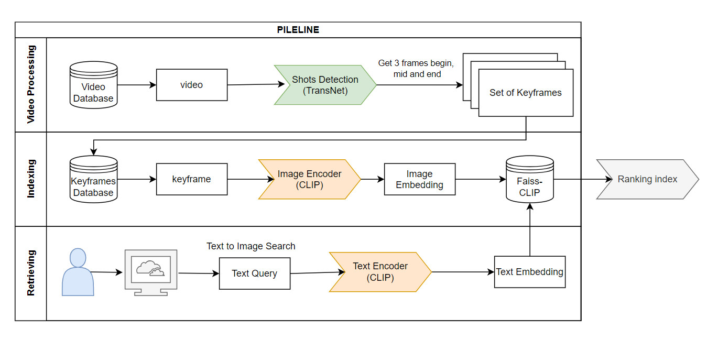
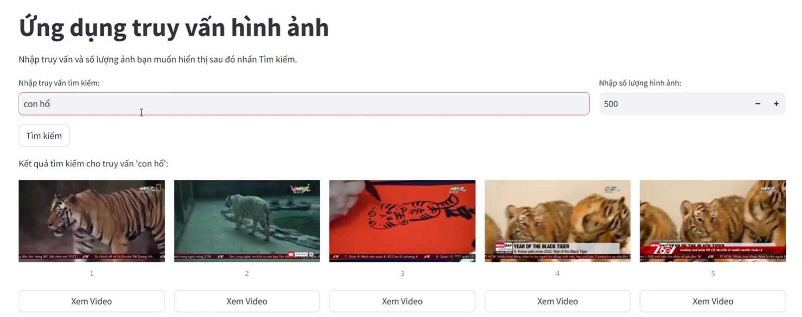

# CLIP-based Text-Video Search System: Bridging Textual Queries and Visual Content
## Abstract

In the contemporary landscape of multimedia retrieval, the fusion of textual queries with video content presents a formidable challenge. This abstract introduces a Text-Video Search System (TVSS) built upon the foundation of the CLIP (Contrastive Language-Image Pretraining) model, aiming to seamlessly bridge the semantic gap between textual input and visual content.

The TVSS leverages the transformative capabilities of the CLIP model, which learns joint representations of images and text through contrastive pretraining. By encoding both textual and visual modalities into a shared embedding space, CLIP enables the system to understand the nuanced relationships between words and images, facilitating effective cross-modal retrieval.

<p align="center"></p>


## Installation and user guide
`Create new conda environment by the following command`
```
conda create -n name_env python=3.9
conda activate name_env
```

### Step 1: Clone Repository
```
git clone https://github.com/TranMinhThang123/VideoSearchCLIP.git
```

### Step 2: Download Keyframes and Dict
Download Keyframes Data and Dict from following path:
- [Keyframes](https://drive.google.com/file/d/1-9Mn8ZjTNzKleQ4uMUYoGwXkXjep-CKP/view)
- [Dict](https://drive.google.com/file/d/1eJWNhsrcexLhZJuufuvODxndYzM_kvBm/view)

Then, move two directories into `Video_Search` folder.

### Step 3: Install requirements
```
pip install git+https://github.com/openai/CLIP.git
pip install -r requirements.txt
```

### Step 4: Start the application 
```
streamlit run main.py
```
## Appendix
Demo GUI
<p align="center"></p>